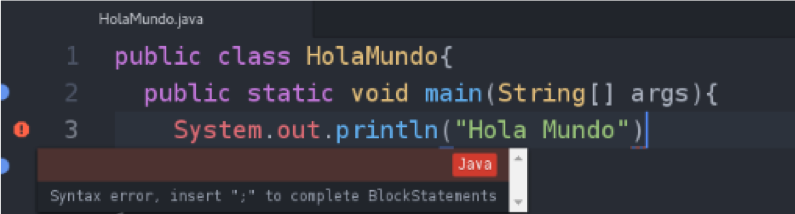

# Unidad 2 - Depuración

---
## Depurador (debugger)
### Concepto
El depurar o debug, es un proceso que permite revisar el código, ésto por medio de una Herramienta o Aplicación que permite la ejecución controlada de un programa o código para seguir cada instrucción ejecutada y localizar asi los errores, códigos de protección, etc.

---
## Depurador (debugger)
### Permite realizar
* La ejecución paso a paso de un programa.
* El establecimiento de puntos de detención.
* La examinación de las variables y objetos en el contenido. 
* El enlazado de llamadas de procedimientos.
* Retomar la ejecución hasta un nuevo punto de detención.

---
## Conceptos de depuración
### Breakpoint
Un Breakpoint es un punto de detención, que en programación es una línea(s) específica(s) en el cual queremos que se detenga el flujo habitual del programa. Los fines pueden ser varios, como verificar el flujo del programa o ver los valores de los datos, etc.

---
## Conceptos de depuración
### Watch expressions

* Nos permiten dar seguimiento a una variable específica dentro que necesitamos observar como va cambiando de valores durante su ejecución.
* Un depurador nos debe proveer esta funcionalidad dentro de sus características.

---
## Depurador a nivel de fuente

* Integrado en en la mayoría de entornos de desarrollo. 
* Cuando el programa encuentra un error desplegará la linea del error. Los errores a desplegar son:
    * Sintaxis
    * Semántica
    * Instrucciones no definidas (clases no encontradas)



---
## Información para depuración

```java
public class HolaMundo {
    public static void main(String[] args) {
        System.out.println("Hola Mundo");
        Integer.parseInt("Hola");
    }
}
```
```java
java HolaMundo
Hola Mundo
Exception in thread "main" java.lang.NumberFormatException: For input string: "Hola"
    at java.lang.NumberFormatException.forInputString(NumberFormatException.java:65) at java.lang.Integer.parseInt(Integer.java:580)
    at java.lang.Integer.parseInt(Integer.java:615)
    at HolaMundo.main(HolaMundo.java:4)
```
### Nombre del error o Excepcion lanzada

```
Exception in thread "main" java.lang.NumberFormatException: For input string: "Hola"
```
### Pila de instrucciones (Stacktrace)
```
    at java.lang.NumberFormatException.forInputString(NumberFormatException.java:65) at java.lang.Integer.parseInt(Integer.java:580)
    at java.lang.Integer.parseInt(Integer.java:615)
    at HolaMundo.main(HolaMundo.java:4)
```

La última linea indica el llamado inicial que desencadenó el error.

---
## Ejercicio

### Instrucciones.java

Utilizando el archivo Instrucciones.java:
1. Revisar el código Java.
2. Identificar y corregir los errores de fuente.
3. Identificar y corregir los errores de ejecución.